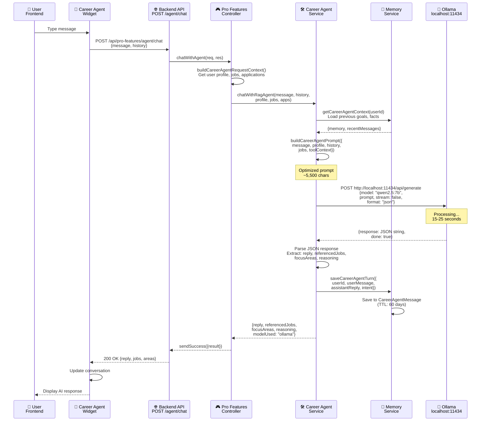
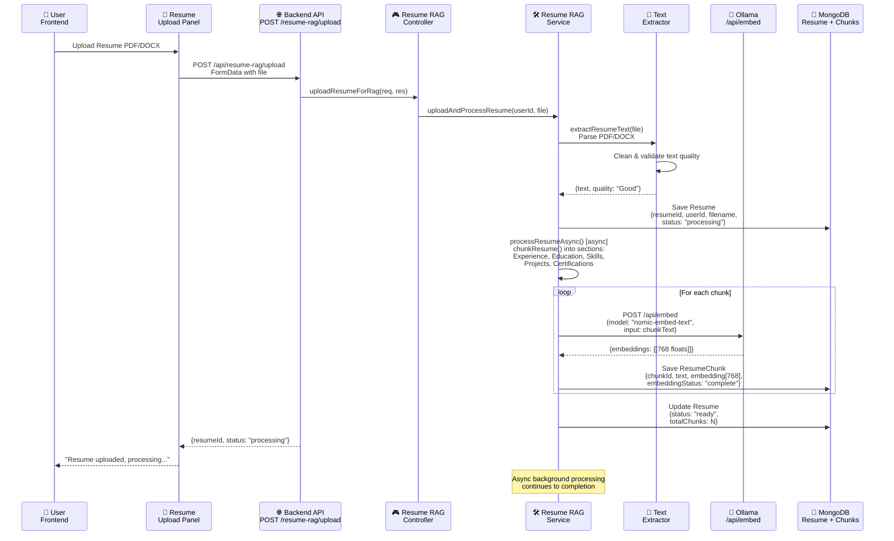
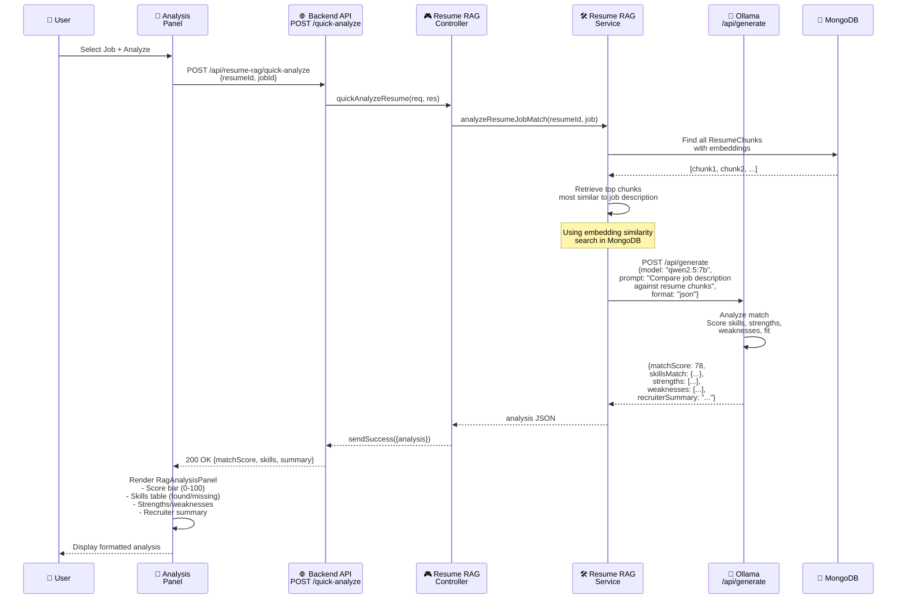
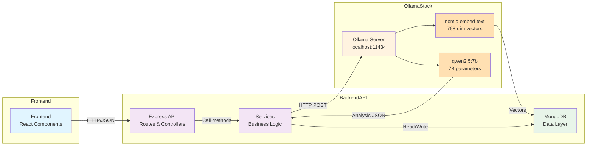

# GetAI Complete Architecture Diagram

## Full System Architecture with Ollama Integration

```mermaid
graph TB
    subgraph Frontend["🎨 FRONTEND (React + Vite)"]
        A1["main.jsx<br/>Root Entry"]
        A2["App.jsx<br/>Theme + Auth + Router"]
        A3["AppRouter.jsx<br/>Routes + Protected Routes"]
        A4["AppShell.jsx<br/>Layout + Navigation"]
        
        subgraph Pages["📄 Pages"]
            P1["LoginPage"]
            P2["ProfilePage"]
            P3["JobsPage"]
            P4["ResumeAtsCheckerPage"]
            P5["ResumeBuilderPage"]
            P6["ProToolsPage"]
            P7["ChatPage"]
            P8["FeedPage"]
            P9["ApplicationsPage"]
        end
        
        subgraph Components["🧩 Components"]
            C1["CareerAgentWidget<br/>AI Chat Widget"]
            C2["RagAnalysisPanel<br/>Resume Analysis UI"]
            C3["ResumeUpload<br/>File Upload"]
            C4["JobMatcher<br/>Job Search"]
        end
        
        subgraph Services["🔧 Frontend Services"]
            S1["api.js<br/>apiRequest()"]
            S2["AuthContext<br/>Auth State"]
            S3["ThemeContext<br/>Theme State"]
        end
        
        A1 --> A2
        A2 --> A3
        A3 --> A4
        A4 --> Pages
        A4 --> Components
        Components --> Services
        Pages --> Services
    end

    subgraph Backend["⚙️ BACKEND (Node.js + Express)"]
        B1["server.js<br/>Express App + Port 5000"]
        
        subgraph Routes["🛣️ API Routes"]
            R1["POST /api/chat/initiate"]
            R2["POST /api/chat/:id/messages"]
            R3["POST /api/pro-features/agent/chat"]
            R4["POST /api/resume-rag/upload"]
            R5["POST /api/resume-rag/quick-analyze"]
            R6["POST /api/resume-rag/applications/:id/analyze"]
            R7["GET /api/jobs"]
            R8["POST /api/applications"]
        end
        
        subgraph Controllers["🎮 Controllers"]
            CO1["chatController.js<br/>Session Management"]
            CO2["proFeaturesController.js<br/>Career Agent Chat"]
            CO3["resumeRagController.js<br/>Resume Analysis"]
            CO4["jobController.js<br/>Job Management"]
            CO5["authController.js<br/>Authentication"]
        end
        
        subgraph Services["🛠️ Backend Services"]
            SVC1["careerAgentService.js<br/>- buildCareerAgentPrompt()<br/>- chatWithRagAgent()<br/>- chatWithCareerAgentOllama()"]
            SVC2["resumeRagService.js<br/>- uploadAndProcessResume()<br/>- chunkResume()<br/>- generateChunkEmbeddings()<br/>- analyzeResumeJobMatch()"]
            SVC3["ollamaService.js<br/>- checkOllamaHealth()<br/>- generateEmbedding()<br/>- analyzeResumeMatch()<br/>- chatWithCareerAgent()"]
            SVC4["careerAgentMemoryService.js<br/>- getCareerAgentContext()<br/>- saveCareerAgentTurn()"]
            SVC5["resumeTextExtractor.js<br/>PDF/DOCX parsing"]
        end
        
        subgraph Models["🗄️ MongoDB Models"]
            M1["ChatSession<br/>participants, messages"]
            M2["ChatMessage<br/>content, role"]
            M3["Resume<br/>resumeId, chunks, status"]
            M4["ResumeChunk<br/>text, embedding[768]"]
            M5["CareerAgentMessage<br/>TTL index: 60 days"]
            M6["CareerAgentMemory<br/>goals, facts"]
            M7["JobSeeker<br/>profile, skills"]
            M8["Job<br/>title, embedding"]
            M9["Application<br/>atsScore, status"]
        end
        
        B1 --> Routes
        Routes --> Controllers
        Controllers --> Services
        Services --> Models
    end

    subgraph Ollama["🤖 OLLAMA (Local LLM Server)"]
        O1["Port: 11434<br/>http://localhost:11434"]
        
        O2["Model: qwen2.5:7b<br/>7 Billion Parameters<br/>- Career Agent Chat<br/>- Resume Analysis<br/>- Job Matching"]
        
        O3["Model: nomic-embed-text<br/>768-Dimensional Embeddings<br/>- Resume Chunks<br/>- Job Descriptions"]
        
        O4["API Endpoints<br/>- /api/generate<br/>- /api/embed<br/>- /api/tags"]
        
        O1 --> O2
        O1 --> O3
        O1 --> O4
    end

    subgraph Database["💾 MongoDB Atlas"]
        DB1["SGETAI Database<br/>10+ Collections"]
        DB1 --> Models
    end

    subgraph External["🔌 External Services"]
        EX1["Supabase<br/>File Storage"]
        EX2["Google OAuth<br/>Authentication"]
        EX3["Gmail<br/>Email Service"]
    end

    %% Frontend to Backend
    S1 -->|HTTP Requests| Backend
    
    %% Career Agent Flow
    C1 -->|/api/pro-features/agent/chat| CO2
    CO2 -->|chatWithRagAgent()| SVC1
    SVC1 -->|chatWithCareerAgent()| SVC3
    SVC3 -->|POST /api/generate| Ollama
    Ollama -->|AI Response JSON| SVC3
    SVC3 -->|response| SVC1
    SVC1 -->|result.reply| CO2
    CO2 -->|reply + metadata| C1
    C1 -->|Display in Widget| Frontend
    
    %% Resume Upload & Analysis Flow
    C3 -->|File Upload| R4
    R4 -->|uploadAndProcessResume()| CO3
    CO3 -->|processResumeAsync()| SVC2
    SVC2 -->|chunkResume()| SVC2
    SVC2 -->|generateEmbedding()| SVC3
    SVC3 -->|POST /api/embed| Ollama
    Ollama -->|[768] embedding| SVC3
    SVC3 -->|embedding| SVC2
    SVC2 -->|Save chunks| Models
    Models -->|Store| Database
    
    %% Analysis Request Flow
    C2 -->|quick-analyze| R5
    R5 -->|analyzeResumeJobMatch()| CO3
    CO3 -->|retrieveSimilarChunks()| SVC2
    SVC2 -->|analyzeResumeMatch()| SVC3
    SVC3 -->|POST /api/generate| Ollama
    Ollama -->|matchScore, skills, summary| SVC3
    SVC3 -->|analysis JSON| SVC2
    SVC2 -->|return| CO3
    CO3 -->|analysis data| C2
    C2 -->|Visualize Results| Frontend
    
    %% Career Memory
    SVC1 -->|Build context| SVC4
    SVC4 -->|Load/Save memory| Models
    
    %% Chat Session
    C1 -->|/api/chat/:id/messages| R2
    R2 -->|sendMessage()| CO1
    CO1 -->|saveCareerAgentTurn()| SVC4
    SVC4 -->|Store message| Models
    
    %% External Services
    CO5 -.->|OAuth| EX2
    CO3 -.->|Upload Resume| EX1
    Controllers -.->|Send Email| EX3
    
    %% Database Connection
    Database -.-> Backend
    
    style Frontend fill:#e1f5ff
    style Backend fill:#f3e5f5
    style Ollama fill:#fff3e0
    style Database fill:#e8f5e9
    style External fill:#fce4ec
```

---

## Data Flow: Career Agent Chat



---

## Data Flow: Resume Upload & Analysis



---

## Data Flow: Resume to Job Analysis



---

## Architecture Summary: Component Interactions



---

## Key Integration Points

### 1. **Career Agent Chat Flow**
- **Frontend Component:** `CareerAgentWidget.jsx`
- **Backend Route:** `POST /api/pro-features/agent/chat`
- **Controller:** `proFeaturesController.chatWithAgent()`
- **Service:** `careerAgentService.chatWithCareerAgentOllama()`
- **Ollama Call:** `ollamaService.chatWithCareerAgent()`
- **Ollama Endpoint:** `POST http://localhost:11434/api/generate`
- **Model:** `qwen2.5:7b`
- **Response Time:** 15-25 seconds (optimized from 365 seconds)

### 2. **Resume Analysis (RAG) Flow**
- **Frontend Component:** `RagAnalysisPanel.jsx` + `ResumeUpload.jsx`
- **Upload Route:** `POST /api/resume-rag/upload`
- **Analyze Route:** `POST /api/resume-rag/quick-analyze`
- **Controller:** `resumeRagController.js`
- **Service:** `resumeRagService.js`
- **Ollama Calls:**
  - `POST /api/embed` (nomic-embed-text) - Generate 768-dim embeddings
  - `POST /api/generate` (qwen2.5:7b) - Analyze resume-to-job match
- **Data Storage:** Resume + ResumeChunk models with embeddings

### 3. **Memory & Context Management**
- **Service:** `careerAgentMemoryService.js`
- **Models:** `CareerAgentMessage`, `CareerAgentMemory`
- **TTL:** 60 days for auto-cleanup
- **Stored Data:** Goals, facts, previous messages

### 4. **Database Models**
- `Resume` - Resume metadata
- `ResumeChunk` - Chunked text + 768-dim embedding
- `CareerAgentMessage` - Chat history (TTL index)
- `CareerAgentMemory` - Agent memory (goals, facts)
- `ChatSession` - Peer-to-peer chat sessions
- `Job` - Job listings with embeddings
- `JobSeeker` - User profiles with skills
- `Application` - Job applications with ATS scores

---

## Environment Variables (.env)

```env
# Ollama Configuration
OLLAMA_BASE_URL=http://localhost:11434
OLLAMA_EMBEDDING_MODEL=nomic-embed-text
OLLAMA_ANALYSIS_MODEL=qwen2.5:7b

# Backend
PORT=5000
NODE_ENV=development
MONGO_URI=mongodb://127.0.0.1:27017/getai

# Frontend
VITE_API_BASE_URL=http://localhost:5000

# Services
SUPABASE_URL=https://...
SUPABASE_SERVICE_KEY=...
EMAIL_USER=your_email@gmail.com
EMAIL_PASS=your_app_password
```

---

## Performance Metrics

| Component | Time |
|-----------|------|
| Resume Upload | 2-5 seconds |
| Resume Chunking | 3-5 seconds (async) |
| Embedding Generation | 0.5s per chunk |
| Career Agent Response | 15-25 seconds |
| Resume Analysis | 10-20 seconds |
| Database Query | <100ms |

---

## Deployment Architecture

```
Development:
- Frontend: http://localhost:5173 (Vite)
- Backend: http://localhost:5000 (Express)
- Ollama: http://localhost:11434 (Local)
- MongoDB: mongodb://127.0.0.1:27017 (Local)

Production (Future):
- Frontend: Vercel/Netlify
- Backend: AWS/GCP/Heroku
- Ollama: Separate server or cloud LLM API
- MongoDB: MongoDB Atlas
```

